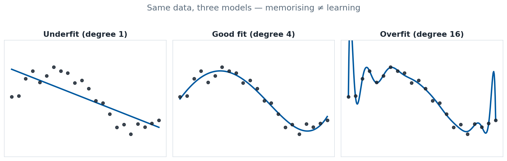
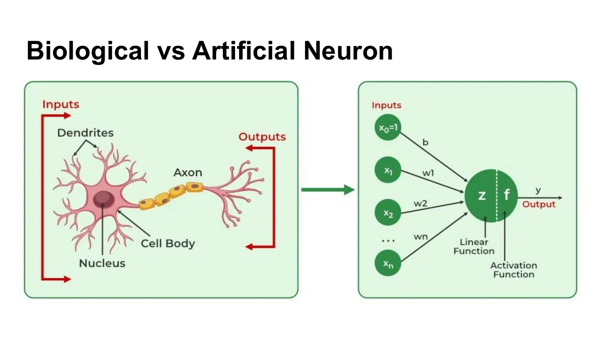

<!-- _class: title -->

# Module 1
# Introduction to TinyML & ML Basics

**TinyML — Condition Monitoring on Microcontrollers**
Day 1 of 3

<!--
Welcome everyone. Quick round of names and what you work with day-to-day — it helps me calibrate. This course is deliberately hands-on: by Wednesday afternoon your microcontroller will be listening to a PC fan and telling you when something is wrong with it. Today we lay the foundations: what TinyML is, enough ML theory to be dangerous, the hardware kit, and getting first data off the sensors. No ML experience assumed — if you have it, you'll enjoy the labs more.
-->

---

## Day 1 roadmap

| Module | Topic | Hands-on |
|---|---|---|
| **1** | TinyML intro + ML basics | Jupyter/Colab: pandas, MLP, MNIST, CNN |
| **2** | Embedded hardware: RAK4631 WisBlock | Blink, accelerometer, microphone bring-up |
| **3** | Data acquisition | Stream sensor data into Edge Impulse |

<!--
The arc of the day: this morning is the only mostly-theory block of the whole course. Module 2 gets the hardware kit assembled and talking, module 3 closes the loop by getting real sensor data off the board and into a dataset tool. By end of day everyone has labelled sensor data in the cloud. Tomorrow we point it all at the fan.
-->

---

## The 3-day arc: sensor → model → anomaly

- **Day 1** — Foundations: ML basics, hardware, first data
- **Day 2** — The fan lab: build a dataset, engineer features, meet the frameworks
- **Day 3** — Train, deploy, detect anomalies, optimise

**Theme throughout:** condition monitoring of a rotating machine — a 120 mm PC fan standing in for the pumps you know.

<!--
The PC fan is our pump-substitute: it rotates, it vibrates, it makes noise, and we can break it in controlled, cheap, repeatable ways — tape a weight on a blade for imbalance, block the airflow, let something scrape. Every technique we use transfers directly to real rotating machinery. That's the pitch; hold me to it on Wednesday.
-->

---

## What is TinyML?

Machine learning inference **on microcontrollers**:

- kilobytes of RAM, megahertz clocks, milliwatts of power
- no OS (or a tiny RTOS), no GPU, often no network
- the model lives *next to the sensor*


> Cloud ML: send data to the model. **TinyML: send the model to the data.**

<sub>Photo: TinyML on edX (HarvardX), V.J. Reddi et al. — used with permission</sub>

<!--
Definition slide. TinyML is the discipline of running trained ML models on devices in the sub-dollar-to-few-dollars class. The key mental flip: instead of shipping raw sensor data to a big model somewhere, we ship a small model into the device and only transmit *conclusions*. Our board has 256 KB of RAM — your laptop's browser tab has about 4000x that. Everything in this course flows from that constraint.
-->

---

## Why ML *on* the microcontroller?

- **Latency** — decision in milliseconds, no round-trip
- **Power** — radio transmission costs far more energy than local compute
- **Privacy** — raw audio/vibration never leaves the device
- **Cost & bandwidth** — thousands of sensors × 16 kHz audio ≠ your network budget
- **Reliability** — works with no connectivity at all

<!--
The four-and-a-half classic arguments. For condition monitoring the power one is the killer: streaming raw vibration data over radio can cost 50x more energy than computing a verdict locally — there is a documented cattle-monitoring collar that got 50x battery life this way. For fleet-scale deployments the bandwidth argument is just as strong: you don't want 16 kHz audio from ten thousand pumps hitting your backend. You want one MQTT message saying "pump 7 sounds wrong".
-->

---

## The TinyML pipeline

```
sensor → acquisition → dataset → features → train → convert → deploy → infer
  (device)   (device)    (PC/cloud)  (both!)   (PC)     (PC)     (device)  (device)
```

- **Train on PC, infer on device** — the golden rule
- Features must be computed *identically* in Python (training) and C (device)

<!--
This pipeline diagram is the course map — we'll revisit it at the start of every module and colour in the box we're working on. Emphasise the train-on-PC/infer-on-device split: nobody trains neural networks on an nRF52 (well, AIfES can, and we'll peek at that Day 2, but it's the exception). The subtle trap is the features box appearing twice: whatever preprocessing you do in Python during training must be re-implemented bit-for-bit in C on the device. Day 2 has a whole validation methodology for that.
-->

---

## Machine learning in one slide

Instead of writing rules, we **learn them from examples**:

- Classical programming: `rules + data → answers`
- Machine learning: `data + answers → rules`

**Supervised learning** — we show the algorithm labelled examples:
*"this vibration is `normal`", "this one is `imbalance`"* — and it learns the mapping.

<!--
The one-slide version for anyone who's never touched ML. Classic Chollet framing: we invert programming. Instead of an engineer writing if-RMS-above-threshold rules, we hand the algorithm examples with correct answers and it finds the rules itself. Everything in this course is supervised learning — labelled examples — except Day 3's anomaly detection, which is the interesting unsupervised exception: there we only show it "normal" and ask it to flag anything else.
-->

---

## Classification vs regression

| | Output | Example |
|---|---|---|
| **Regression** | a number | house price in $1000s |
| **Classification** | a class + probabilities | `normal` / `imbalance` / `blocked` |

⚠️ A classifier **always** outputs probabilities summing to 1.0 — even on garbage input. (Day 3: anomaly detection fixes this.)

<!--
Two task types, and you'll do one of each within the hour: house-price regression and MNIST digit classification. Plant the warning flag now, because it pays off on Day 3: a 3-class softmax classifier fed data from a fault it has never seen will still confidently say "62% imbalance". It cannot say "I don't know". That's not a bug, it's the maths — and it's why anomaly detection exists.
-->

---

## Train / validation / test split

- **Training set** — the model learns from this (~70–80%)
- **Validation set** — tune hyperparameters, detect overfitting during training
- **Test set** — touched **once**, at the end, for the honest number

**Cardinal sin:** letting test data leak into training.
For sensor data: split by *recording session*, not by *sample*!

<!--
The split discipline. The last line is the one people get wrong with time-series sensor data: if you cut one long fan recording into windows and randomly scatter them across train and test, adjacent — nearly identical — windows end up on both sides and your accuracy is a lie. Split by session or by day. We'll enforce this in the fan lab tomorrow, and Edge Impulse helps by keeping train/test buckets separate at upload time.
-->

---

## Overfitting

- **Underfit** — model too simple: bad on training AND test data
- **Good fit** — learns the pattern, generalises
- **Overfit** — memorises the training data: great training accuracy, poor test accuracy



Watch the gap between training loss and validation loss.

<!--
Draw the three-panel underfit/fit/overfit sketch on the whiteboard — a wobbly polynomial through noisy points lands better live than any slide. The practical detector: training loss keeps falling while validation loss turns upward — that inflection is where you stop. With our tiny fan datasets (minutes of data, not ImageNet), overfitting is the default failure mode, which conveniently is also why tiny models often win on tiny data.
-->

---

## 🧪 Lab checkpoint 1 — pandas & house prices (~35 min)

**`exercises/module1-ml-basics/`** → parts 1–2

- Part 1: pandas warm-up (skimmable if you use it daily)
- Part 2: California-housing MLP — your first trained model
- **Done when:** you have a test-set error and can say whether it's any good

<!--
First hands-on break — classic ML before neural networks. 35 minutes; the discussion checkpoint in part 2 (is a $50k mean error good?) is worth pulling the group together for. Anyone racing ahead can start MNIST early — checkpoint 2 finishes it.
-->

---

# Part 2: Neural networks
### the 20-minute tour

<!--
Section break. Next ~8 slides condense the "Introduction to Neural Networks" lecture deck — terminology, building blocks, and how learning works. The efficiency-metrics half of that deck (MACs, model size, peak RAM) returns on Day 3 when we optimise. Keep the pace brisk; the notebooks after this make it concrete.
-->

---

## From biological to artificial neuron



<!--
The obligatory biology slide — dendrites in, axon out. The artificial version on the right is all we need: inputs x1..xn, each multiplied by a weight w, summed with a bias b, pushed through a nonlinear activation f, out comes y. That's it. A neuron is a weighted sum with attitude. Everything else in deep learning is arranging thousands of these and finding good values for w and b.
-->

---

## Core terminology

| Term | Meaning |
|---|---|
| **Neuron** | weighted sum + activation function |
| **Weight (w)** | learnable strength of a connection |
| **Bias (b)** | learnable offset — shifts the decision boundary |
| **Activation f(·)** | nonlinearity: ReLU, sigmoid, tanh, softmax |
| **Parameter** | any trainable value (weights + biases) → **model size** |
| **Feature** | an input signal, or a learned representation inside the net |

<!--
Vocabulary drill, straight from the NN lecture deck. The one to circle for TinyML: parameter count determines model size. Every parameter is a number stored in flash — 10k parameters × 4 bytes float32 = 40 KB of our 1 MB, and flash fills faster than you'd think once the BLE stack and SDK move in. That arithmetic instinct — params × bytes = footprint — should become reflexive by Day 3.
-->

---

## Layers

1. **Input layer** — receives raw data; its shape must match your data
2. **Hidden layers** — the actual computation, weighted sums + activations
3. **Output layer** — one neuron per regression target, or one per class

"Deep" learning = more than one hidden layer. That's the whole secret.

<!--
Layers stack like Lego. Input layer does no computation, it's a shape declaration — 13 housing features means shape (13,), a 28x28 image flattened means (784,). Output layer: for regression, 1 linear neuron; for classification, one neuron per class with softmax. The "deep" in deep learning is genuinely just "has multiple hidden layers" — good demystifier for the sceptics in the room.
-->

---

## Dense layers & the parameter count

Every neuron connects to **all** neurons in the previous layer.

`params = inputs × outputs + outputs`

| Input | Output | Params | Size (f32) |
|---|---|---|---|
| 12 | 32 | 416 | 1.6 KB |
| 128 | 64 | 8,256 | 32 KB |
| 784 (28×28) | 128 | 100,480 | 393 KB |

⚠️ 784→128 alone claims **~40 % of our 1 MB flash** — weights live in *flash*; RAM (256 KB) is reserved for activations and buffers. This is why CNNs exist.

<!--
The parameter-count table from the NN deck, trimmed to the punchline rows. Walk the formula once: 12 inputs to 32 outputs = 384 weights + 32 biases = 416. Then the shocker: one modest dense layer on a flattened 28x28 image is 100k parameters — 393 KB in float32, over a third of the nRF52840's 1 MB flash gone on a single layer, before the BLE stack and your application move in. Be precise about where things live: weights sit in flash; RAM holds the activations flowing through the network at inference time — Day 3's Module 9 tells that story in full. Dense layers scale O(n²) in width. CNNs (this afternoon's teaser) exploit spatial structure to escape that.
-->

---

## Activation functions — the MCU view

| Function | Use case | MCU cost |
|---|---|---|
| **ReLU** `max(0,x)` | hidden layers (default) | **very low** |
| Leaky ReLU | hidden layers (alt) | very low |
| Sigmoid | binary output | high (exp) |
| Tanh | hidden, centered | high (exp) |
| Softmax | multi-class output | moderate |

**On microcontrollers: ReLU is the default.** It's a compare and a select.

**Softmax** turns the output layer's raw scores into probabilities:
$\text{softmax}(z_i) = e^{z_i} / \sum_j e^{z_j}$ — always positive, always sums to **1.0**.

<!--
Activation function zoo, with the column that matters to us: compute cost. ReLU is max(0,x) — one comparison, no lookup table, no exponential. Sigmoid and tanh both need exp(), which is genuinely expensive on a Cortex-M4F. So the TinyML recipe is boring and effective: ReLU everywhere in hidden layers, softmax only at the output where you need probabilities. Spend one sentence on the softmax formula — exponentiate each output score, divide by the sum, so the outputs are guaranteed positive and sum to exactly 1.0. That "always sums to 1.0" property is the entire premise of Day 3's anomaly detection module, so it's worth planting properly now. Same table as the lecture PDF, page 11.
-->

---

## How the network learns

```
forward pass → compute loss → backpropagation → update weights
        ↑                                            |
        └───────── repeat for many epochs ───────────┘
```

- **Loss function** — how wrong are we? (MSE for regression, cross-entropy for classification)
- **Backpropagation** — chain rule assigns blame to every weight
- **Optimizer** (SGD, Adam) — nudges weights downhill: `w ← w − η·∇L`

<!--
The training loop in one diagram. Forward pass: predict. Loss: score the error — MSE for regression, cross-entropy for classification, and that choice is basically dictated by task type. Backprop: calculus distributes the blame backwards through the layers. Optimizer: take a small step downhill. Repeat over the dataset many times. Nobody needs to derive backprop today — Keras does it — but knowing the loop explains every knob you're about to turn in the notebooks.
-->

---

## Epochs, batches, learning rate

- **Epoch** — one full pass through the training set
- **Batch size** — samples processed before each weight update
- **Learning rate η** — step size. *The* most critical hyperparameter:
  - too high → training diverges, loss explodes
  - too low → training crawls, or gets stuck

You will break this on purpose in the MNIST exercise.

<!--
The three knobs students actually touch. Learning rate gets the airtime: it's the first thing to fiddle when training misbehaves. In the MNIST notebook there's an explicit task to crank it up until the loss explodes and down until nothing happens — sanctioned vandalism, and the fastest way to build intuition for what those loss curves are telling you.
-->

---

## A Keras model in 8 lines

```python
from tensorflow import keras

model = keras.Sequential([
    keras.layers.Input(shape=(13,)),
    keras.layers.Dense(64, activation="relu"),
    keras.layers.Dense(64, activation="relu"),
    keras.layers.Dense(1)                      # regression: 1 linear output
])
model.compile(optimizer="adam", loss="mse", metrics=["mae"])
model.fit(X_train, y_train, epochs=100, validation_split=0.2)
```

<!--
The Keras Sequential recipe — this exact shape appears in the house-price notebook you're about to run. Point at the mapping from theory to code: Input shape = feature count, Dense+relu = the hidden layers we discussed, single linear output = regression, compile picks loss and optimizer, fit runs the training loop with a validation split built in. Eight lines. The hard part of ML was never the model definition — it's the data, which is the theme of this entire course.
-->

---

## Today's three datasets

| Dataset | Task | Input | Why |
|---|---|---|---|
| **California housing** | regression | 8 numeric features | hand-made features |
| **MNIST** digits | 10-class classification | 28×28 grayscale | raw pixels, dense NN |
| **CIFAR-10** | 10-class classification | 32×32 RGB | CNN teaser |

(The old course used Boston housing — deprecated for ethical reasons; California is the drop-in successor.)

<!--
The progression is deliberate: housing = a table of human-engineered features, someone already decided "number of rooms" matters. MNIST = raw pixels, no features, the network figures everything out itself. CIFAR = raw pixels but hard enough that dense layers fail and you need convolutions. Footnote for honesty: the classic Boston dataset was removed from scikit-learn over the racially problematic 'B' feature — worth ten seconds if anyone asks, it's a decent data-ethics anecdote.
-->

---

## Features vs raw data — the running theme

- **Housing:** features engineered by humans → tiny model works
- **MNIST:** raw pixels → the network learns its own features → more params

**TinyML corollary:** good hand-crafted features (RMS, FFT peaks…)
buy you a **much smaller model**. Day 2 is dedicated to this.

<!--
This contrast — lifted from the old MNIST exercise text, where it was a throwaway comparison to Boston — is arguably the most important strategic idea of the course. On a 256 KB device you often can't afford the network to learn its own features from raw data. Computing RMS and a few spectral peaks in C first can shrink the model 10-100x. Day 2 module 5 is entirely about this, and Day 3 compares both approaches head-to-head on the fan.
-->

---

## 🧪 Lab checkpoint 2 — MNIST & CIFAR (~50 min)

**`exercises/module1-ml-basics/`** → parts 3–4
*(parts 1–2 were checkpoint 1, before the NN section)*

3. **MNIST** — dense NN classifier, play with learning rate
4. **CIFAR-10** — CNN teaser (optional if time is short)

All run in **Google Colab** (zero install) or local Jupyter.
Discussion checkpoints in the README.

<!--
Hand-off. Everything is linked from the README — Colab needs only a Google account, zero installation, or run locally in the tinyml-env from the setup guide. Pandas section is skimmable for anyone who uses it daily, but don't skip it entirely: the same describe-and-plot moves get used on their own accelerometer data in module 3. Circulate during the lab; pull the group together at the discussion checkpoints. CIFAR is the pressure valve — declare it optional if module 2 needs the time.
-->

---

## Module 1 wrap-up

You now have:

- ✅ The TinyML pipeline in your head
- ✅ Supervised learning, splits, overfitting
- ✅ NN anatomy: neurons, layers, activations, training loop
- ✅ Hands-on Keras: regression + classification

**Next:** the hardware. 256 KB of RAM and a very keen microphone.

<!--
Recap and bridge. The theory box of the pipeline is coloured in; everything from here on is progressively more hands-on. After the break: unbox the WisBlock kit, get the toolchain proven (most did the pre-course setup guide — module 2 has triage time for the rest), and make LEDs blink and sensors talk. Coffee now.
-->

---

## Sources & acknowledgements

This course builds on excellent open material:

- **TinyML on edX** (HarvardX) — Prof. **Vijay Janapa Reddi** et al.
  Figures and framing reused **with permission** (attributed per slide)
- **A. Géron**, *Hands-On Machine Learning* notebooks (`handson-ml3`, Apache-2.0)
- **Jon Nordby** — **emlearn** (open-source ML inference for MCUs)
- **Fraunhofer IMS** — **AIfES** (AI framework for embedded systems)

Thank you to all authors for making high-quality TinyML material open.

<!--
Credits slide — leave it up during the break. The HarvardX TinyML specialization by VJ Reddi's group is the deepest free resource if participants want to go further after the course; permission for figure reuse was granted by the author (2026), and each borrowed figure carries its own source line. Géron's notebooks power parts of the module 1 lab. emlearn and AIfES both reappear in module 6.
-->
