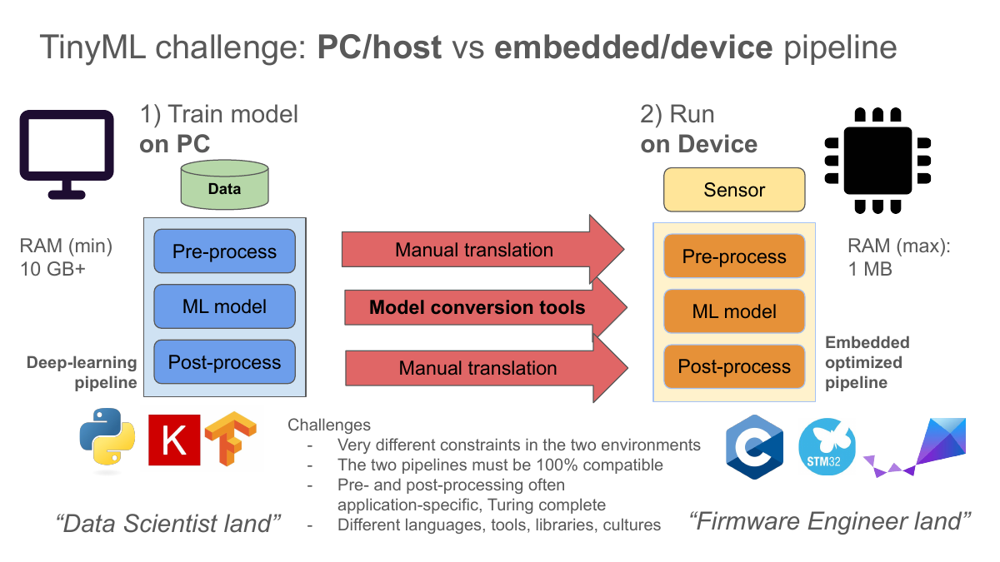

<!-- _class: title -->

# Module 6
# ML Frameworks for Microcontrollers

**Edge Impulse · emlearn · AIfES · TFLite-Micro**
TinyML Course · Day 2

<sub>emlearn material adapted from Jon Nordby, "Practical TinyML with emlearn", Aarhus University, March 2026 — with thanks.</sub>

<!--
Last module of Day 2. Participants now have a dataset (M4) and validated features (M5). The question: which framework carries the model from Python to the nRF52840? We survey four realistic options, build a decision framework (licence / footprint / workflow / lock-in), then go deep on emlearn because it's the most transparent — you can read every line it generates. Hands-on: XOR random forest trained in sklearn, converted to a C header, classifying live on the RAK4631. Guest-author credit for the emlearn slides belongs to Jon Nordby (jononor@gmail.com).
-->

---

# The problem every framework solves



<sub>Figure: Jon Nordby, "Practical TinyML with emlearn", Aarhus 2026 — with thanks.</sub>

**Two pipelines, one behaviour:** train on a 10 GB+ PC in Python — run in ≤ 1 MB, in C, on battery. Every arrow between them is a chance to introduce a silent mismatch.

<!--
Nordby's framing (deck p.8): "Data Scientist land" (Python/Keras/TF) vs "Firmware Engineer land" (C/vendor SDKs). Pre-/post-processing usually needs manual translation (that was Module 5!); the model itself is where conversion tools help. A framework = someone's opinionated answer to how much of this gap to automate, and what you pay for it — in money, bytes, or freedom.
-->

---

# The four contenders

| | One-liner |
|---|---|
| **Edge Impulse** | End-to-end SaaS: data → DSP → training → deployable C++ library |
| **emlearn** | "scikit-learn for microcontrollers": Python train → tiny portable C99 header |
| **AIfES** | Fraunhofer IMS C library: NN inference **and training on-device** |
| **TFLite-Micro** | Google's reference NN interpreter for MCUs; the ecosystem default |

Plus honourable mentions: MicroPython + emlearn-micropython, CMSIS-NN (kernel layer), vendor tools (ST Cube.AI, NXP eIQ...).

<!--
Scope note: all four run fine on our nRF52840. Vendor-specific tools (Cube.AI etc.) are out of scope but follow the same evaluation grid. micromlgen/m2cgen are smaller emlearn-alikes. Keep this slide fast — the depth comes per-framework next.
-->

---

# Edge Impulse

- **Workflow**: Studio (web) — ingestion, labelling, DSP blocks, NN/classical training, EON-compiled C++ export; CLI tools for data forwarding
- **Models**: dense NN, 1D/2D CNN (Keras under the hood), classical blocks, K-means/GMM anomaly
- **Footprint**: EON compiler generates model as C++ (no interpreter) — RAM/flash shown *per build* in Studio
- **Licence/cost**: free developer tier; paid enterprise; **generated SDK ships with your project** — core parts Apache-2.0 <!-- VERIFY: EI re-licensed parts of the edge-impulse-sdk after 2024, and Edge Impulse was acquired by Qualcomm in 2025 — re-check the exact licence text shipped in a current C++ export before stating this in class -->
- **Lock-in**: data is exportable; the *pipeline* (DSP config, training, EON) lives in their cloud

<!--
We've been using EI since Module 3, so this is naming what they already experienced. Strengths: fastest zero-to-demo, feature explorer, on-device performance estimates before deploying. Weaknesses: training happens in their cloud (data governance question for corporate use), free tier limits (compute time/project size), and the acquisition question: pricing and terms are a business decision made by someone else. Demo hook: Module 4's fan project -> Deployment tab -> C++ library -> show the generated folder structure.
-->

---

# 🧪 Kick this off now — EI export (~5 min, then it builds while we talk)

In **your fan project** from Module 4:

1. Impulse design → add **Spectral Analysis** + a small NN → train
2. **Deployment** → C++ library (or Arduino library) → **Build**
- The build runs server-side — collect the .zip when we reach the lab
- **Done when:** the download link exists (we compile it in the lab)

<!--
Deliberate mid-lecture kick-off: EI Studio builds take minutes of server time, so starting the export now means zero waiting during the lab. It also makes the point that EI's workflow is asynchronous SaaS — which is exactly the governance/licence discussion three slides from now.
-->

---

# emlearn

- **Workflow**: train with plain scikit-learn/Keras → `emlearn.convert(model)` → `.save()` → one C header → `#include`, call `predict()`
- **Models**: Decision Tree, **Random Forest**, ExtraTrees, KNN, Gaussian NB, GMM/EllipticEnvelope (anomaly), MLP
- **Footprint**: from **~2 kB flash**; no interpreter, no malloc, pure C99; integer/fixed-point support
- **Licence**: **MIT** — do anything, ship anywhere
- **Lock-in**: none worth the name — output is readable C you can version-control

<!--
The philosophical opposite of EI: no cloud, no accounts, no black box. The generated file is genuinely readable — for a small RF you can trace a prediction by hand (we will, in the exercise). Limits to be equally honest about: no DSP/feature tooling (you write it — Module 5 was exactly that), NN support is basic MLP (no CNN in C path), and dataset/label management is on you. Maintained by Jon Nordby, used in 40+ publications, real products (soundsensing HVAC monitoring — condition monitoring, same as our use case!).
-->

---

# AIfES

- **Workflow**: define the network **in C** (layers/weights as arrays); import Keras/PyTorch weights, or train from scratch **on the device**
- **Models**: dense feed-forward NN (f32 **and Q7 quantised**); CNN support growing
- **Footprint**: a few kB–tens of kB; benchmarks vs TFLM: **~2.1× faster, up to 3.9× less memory** (Fraunhofer workshop numbers)
- **Licence**: **AGPL-3.0** open-source, **commercial licence available from Fraunhofer** <!-- VERIFY: confirm current AIfES for Arduino licence terms — AGPL + paid commercial dual-licensing as of the 2026 workshop; AGPL is a hard blocker for closed firmware unless the commercial licence is bought -->
- **Lock-in**: library API; weights are portable C arrays

<!--
AIfES' unique selling point is on-device training/fine-tuning — a pump could adapt its baseline to its own installation without any cloud. That's Day 3 territory conceptually (their Task 1/2 workshop zips already target nRF52840, near drop-in for our board). The AGPL point deserves emphasis with this audience: linking AIfES into proprietary pump firmware triggers AGPL obligations unless you buy the Fraunhofer commercial licence — a legal decision, not an engineering one. Benchmarks quoted from the Fraunhofer Aarhus workshop deck (brightspace-export, 20250411 PDF).
-->

---

# TensorFlow Lite for Microcontrollers

- **Workflow**: Keras → TFLite converter (+ int8 quantisation) → FlatBuffer byte array → **interpreter** runs it on-device
- **Models**: NN only — dense, CNN, RNN subsets; ~60–100 supported operators
- **Footprint**: interpreter core ~16 kB+ flash, plus per-operator kernels + **tensor arena** (RAM, you size it)
- **Licence**: **Apache-2.0**
- **Lock-in**: low-ish — open format, but you inherit the TF toolchain and its churn


<sub>Figure: TinyML on edX (HarvardX), V.J. Reddi et al. — used with permission</sub>

<!--
TFLM is the reference point everyone benchmarks against — and what EI historically used underneath (with EON removing the interpreter overhead). Interpreter architecture pros: swap models without recompiling (it's data). Cons: pay interpreter+arena overhead, and operator-support roulette — exotic Keras layers fail at conversion. On nRF52840, CMSIS-NN kernels accelerate int8 conv/dense significantly. Note the project renamed/moved to LiteRT — VERIFY current repo name when preparing links.
-->

---

# The comparison table

| | Edge Impulse | emlearn | AIfES | TFLite-Micro |
|---|---|---|---|---|
| **Licence** | SaaS + SDK (parts Apache-2.0)¹ | MIT | AGPL-3.0 / commercial¹ | Apache-2.0 |
| **Train where** | their cloud | your PC (sklearn) | PC **or on-device** | your PC (TF) |
| **Model types** | NN, CNN, classical, anomaly | trees, KNN, GMM, NB, MLP | dense NN (f32/Q7) | NN (op subset) |
| **Feature/DSP tooling** | ✔ built-in blocks | ✘ DIY (M5!) | ✘ DIY | ✘ DIY |
| **Footprint floor** | ~10s of kB | **~2 kB** | ~few kB | ~20 kB + arena |
| **Runtime style** | generated C++ (EON) | generated C99 | C library + weight arrays | interpreter + FlatBuffer |
| **Vendor lock-in** | pipeline in cloud | none | low (API) | low (format) |
| **Best when** | speed to demo, team workflow | classical ML, tiny targets, full control | on-device learning, no-Python shops | existing TF models, ecosystem |

¹ see VERIFY notes on the framework slides — check current terms before productising.

<!--
This is the module's take-home artefact — the exercise worksheet is a blank version of this table that participants fill from the framework docs, then we reconcile against this. Footprint numbers are floors/orders of magnitude, model-dependent in every case. The row that surprises engineers most is "Feature/DSP tooling": three of four frameworks assume you bring your own features — which is why Module 5 exists.
-->

---

# Selection criteria 1 — licence & governance

- **Can you ship it?** MIT/Apache: yes. AGPL: only with source release or commercial licence
- **Where does the data go?** SaaS training = your vibration data in someone's cloud
  - fine for a PC fan; a question for pump telemetry with customer data
- **Who controls pricing/roadmap?** open-source: fork-able; SaaS: acquisition risk is real
- Ask legal *early* — retrofitting a licence change into shipped firmware is misery

<!--
Framing for a corporate audience: for a course prototype anything goes; for product firmware, licence review is a gate. The EI/Qualcomm situation is a live case study of platform risk — not a criticism, just a fact pattern (pricing, terms, and priorities can change post-acquisition). AGPL: emphasise it's not "evil", it's a business model — Fraunhofer wants commercial users to pay, which is fair, but it must be a conscious decision.
-->

---

# Selection criteria 2 — footprint & fit

Our budget on RAK4631: **256 KB RAM / 1 MB flash** — minus BLE stack, drivers, app...

- Trees (emlearn): flash ∝ total node count, RAM ∝ #features — **O(kB)**
- Dense NN on features: weights = (inputs×units) floats — small
- CNN on raw windows: activations dominate → **RAM (not flash) is the wall**
- Interpreter frameworks add a fixed floor before the first model byte
- Rule: measure with *your* model — every framework's "typical" number is marketing

<!--
Callback to Module 1's NN deck: peak activations matter more than parameter count on MCUs. Day 3 Module 7 makes this concrete with the accuracy-vs-RAM/flash/latency shoot-out of RF vs dense-NN vs CNN on the fan data. For now the mental model: classical model on good features (Module 5!) is the footprint champion; CNN buys you freedom from feature engineering at ~10-100x resources (Elsts & McConville 2021, via Nordby).
-->

---

# Selection criteria 3 — workflow & lock-in

- **Iteration loop length**: data → model → device → observe. EI: minutes, all-GUI. emlearn: minutes, all-scriptable. TFLM: converter friction. AIfES: manual weight plumbing
- **Reproducibility**: can you re-create today's model in 2 years?
  - scripts + pinned versions (emlearn/TFLM) vs cloud project state (EI)
- **Team shape**: GUI-first team ↔ EI; firmware-first team ↔ emlearn/AIfES
- **Exit cost**: what does migrating away require? (retraining? rewriting DSP? re-labelling?)

<!--
Lock-in is not binary; it's exit cost. EI: your raw data exports cleanly, but the tuned DSP + model config is theirs — exiting means rebuilding the pipeline (Module 5 taught you how, deliberately). emlearn: exit = keep the generated C forever. Encourage the "2-year reproducibility" test as the sharpest single question to ask any vendor.
-->

---

# Deep dive: emlearn
## Why we go deep on this one

- Everything visible: input C, output C, no cloud between
- Perfect teaching vehicle for the **convert-to-C** pattern used by *all* codegen frameworks
- Directly productive: Day 3's Random Forest on your fan features deploys via emlearn
- *Slides in this section adapted from Jon Nordby's guest lecture (Aarhus, March 2026)*

<!--
Being transparent about pedagogy: EI they've used hands-on since Module 3; TFLM/AIfES get conceptual treatment (AIfES workshop zips are available as an extension for the curious — already nRF52840-targeted); emlearn gets the full train-convert-deploy loop because seeing the generated if/else trees demystifies "a model on an MCU" better than anything else.
-->

---

# emlearn: the whole process

```
0.  pip install emlearn
1.  train:    model = RandomForestClassifier(...).fit(X, y)
2.  convert:  cmodel = emlearn.convert(model, method='inline')
              cmodel.save(file='xor_model.h', name='xor_model')
3.  use:      #include "xor_model.h"
              out = xor_model_predict(features, N_FEATURES);
```

- Header-only generated C99: **no dynamic allocation, portable, testable on your laptop with gcc first**
- Same code runs on host and device → validate before flashing

<!--
The 4-step recipe from Nordby's deck pp.16-21. method='inline' generates the trees as nested if/else code (self-contained); method='loadable' generates data arrays walked by eml_trees.h from the emlearn package includedir — smaller for big forests, needs the include path. For the exercise we use 'inline' so a single header drops into a PlatformIO project with zero build-system surgery. The "compile on laptop first" habit comes straight from the old Exercise 1 (gcc on host) and Nordby's pipeline-validation practice.
-->

---

# emlearn: training tips for embedded targets

```python
from sklearn.ensemble import RandomForestClassifier
# keep the model small ON PURPOSE
estimator = RandomForestClassifier(n_estimators=10, max_depth=10)
estimator.fit(X, y)
```

- **Limit model size at training time** (`n_estimators`, `max_depth`, `min_samples_leaf`)
- Consider integer inputs (int16) — enables integer-only inference paths
- Trees need **no feature scaling** — one less PC-vs-device mismatch

<!--
From Nordby deck p.18. The "no scaling needed" property of trees is underrated for TinyML: with an MLP you must replicate StandardScaler's offset/scale arrays in C exactly (the old NN_w_selectedFeatures notebook exports them as C arrays — Day 3); with trees the thresholds are learned in raw feature units. Model-size discipline: emlearn.evaluate.trees has model_size_bytes and compute_cost_estimate to check before deploying.
-->

---

# emlearn: cost model for tree ensembles

| Resource | Scales with |
|---|---|
| RAM | O(#features) — basically just the input vector |
| Flash | O(#nodes) ≈ trees × 2^depth |
| CPU | Σ effective depth per tree (data-dependent!) |

- More trees → more capacity, **less** overfitting; deeper trees → more capacity, **more** overfitting
- Tune `n_estimators` + one depth-limiting parameter with `GridSearchCV`
- `emlearn.evaluate.pareto`: find the accuracy-vs-compute **Pareto front**

<!--
Nordby deck pp.38-41. The asymmetry is the useful takeaway: adding trees is cheap-ish and regularises; adding depth explodes flash (2^D) and overfits. The Pareto-front idea generalises beyond trees: for any framework, sweep hyperparameters and plot accuracy vs bytes — deploy from the front, never from above it. Day 3 Module 9 reuses this exact tool for quantised-tree dtype choices (float/int16/int8).
-->

---

# emlearn in the wild

- **Soundsensing** (Nordby's company): sound/vibration condition monitoring of building HVAC — our fan lab, productised
- **Cattle health collar** (Virginia Tech): decision tree on accelerometer, LoRaWAN uplink — **< 1 mW**, 50× less power than streaming raw data
- **Breathing-rate earable** (Samsung Research): RF on audio features
- **Toothbrush timer**: M5StickC, ~500 lines of MicroPython, data collected + labelled in ~1 h

<!--
All four from Nordby's 2026 deck (pp.2, 27, 52-56). The cattle collar is the 50x number they've now heard twice — Module 1's why-TinyML slide and this morning's fan lab — so name it as a callback ("remember the collar?") and point out this is the actual source: classify on-sensor, transmit 1 byte instead of 1 KiB — that's the entire economic argument for TinyML on LoRa-class links, and RAK4631 has the same SX1262 LoRa radio. The toothbrush proves the methodology is a weekend, not a moonshot — good final-project encouragement.
-->

---

# Exercise hand-off — Module 6

**`exercises/module6-emlearn/`**

1. **`xor-train/`** — laptop: sklearn RF on the XOR dataset → plot decision boundary → `emlearn.convert()` → `xor_model.h` (+ verify predictions in Python)
2. **`xor-device/`** — PlatformIO: drop the header into `include/`, classify pairs over **serial input**, LED feedback, measure latency with `micros()`
3. **EI round-trip** (~15 min) — your Module 4 fan project → Studio *Deployment* → Arduino library → unzip into a PlatformIO project's `lib/` and **build** for the RAK4631 (no inference code yet — Module 7 writes that)
4. **Worksheet** — `framework-comparison.md`: fill the licence/footprint/workflow/lock-in table from the frameworks' own docs; we reconcile at the wrap-up

Bonus: circular dataset — how many trees/depth to fit a ring? · Try `method='loadable'` and diff the headers

<!--
XOR is deliberately trivial ML — the learning target is the toolchain loop, which should take under an hour, leaving time for the round-trip and the worksheet. The random forest itself got its five-minute intro in Module 5, and the full mechanics come tomorrow morning in Module 7 — for XOR, the if/else-cascade intuition is all anyone needs. Serial-input classification (type "0.9 0.1" -> class 1) replaces the old Photon exercise's analog-pin inputs — fewer wires, same lesson; the old exercise's 12-bit-ADC scaling discussion becomes a note. The old build.mk include-path dance becomes: copy one header into include/. Step 3 is the EI hello-world deployment round-trip promised in the course plan: it proves the whole Studio-to-PlatformIO export path compiles TODAY, so tomorrow's Module 7 lab starts from a known-good toolchain instead of debugging the export under time pressure. Latency bonus carries over from the old Exercise 2 verbatim.
-->

---

# Wrap-up: the decision in one slide

- **Prototyping / teaching / this course**: Edge Impulse for speed **+ emlearn for understanding** — they compose (EI for data, emlearn for the model, your C features in between)
- **Product, classical ML, tiny budget**: emlearn (MIT, 2 kB, readable)
- **Product, NN, on-device adaptation**: AIfES (budget for the commercial licence)
- **Existing TF/Keras investment, NN-heavy**: TFLite-Micro (+ CMSIS-NN)
- In every case: **your features, your validation** (Module 5) travel with you

<!--
End of Day 2. Recap arc: dataset (M4) -> features (M5) -> framework mechanics (M6). Tomorrow morning (M7) we combine all three: RF via emlearn AND NN/CNN via Edge Impulse on the fan dataset, deployed to the same firmware, judged on accuracy vs RAM vs flash vs latency. Ask everyone to bring their filled comparison worksheet — first 10 minutes of Day 3 reconcile them.
-->

---

# References & further material

- Jon Nordby — *Practical TinyML with emlearn* (Aarhus 2026) — course share, credit required on reuse
- Fraunhofer IMS — *AIfES Workshop* decks + nRF52840 task zips (2025/2026) — in course share
- emlearn docs: `emlearn.readthedocs.io` · repo: `github.com/emlearn/emlearn`
- AIfES: `github.com/Fraunhofer-IMS/AIfES_for_Arduino`
- TFLite-Micro: `github.com/tensorflow/tflite-micro` <!-- VERIFY: check for LiteRT rename/migration before class -->
- Edge Impulse docs: `docs.edgeimpulse.com`
- Elsts & McConville (2021), *Are Microcontrollers Ready for Deep Learning-Based HAR?*

<!--
The AIfES workshop zips (brightspace-export items #37/#38) target nano33ble = nRF52840 and port to the RAK4631 by swapping the board name — offer them as homework for anyone who wants the AIfES hands-on we didn't do in class.
-->
